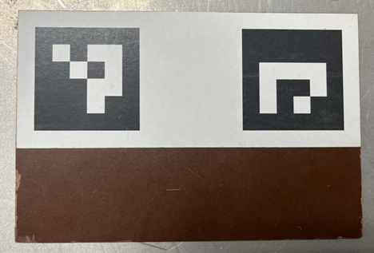
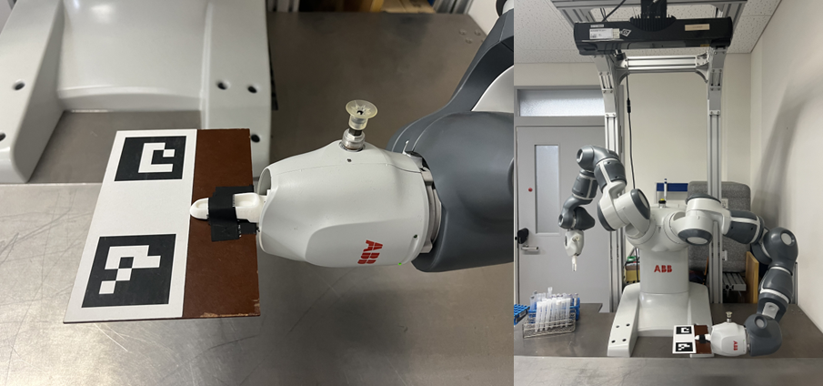
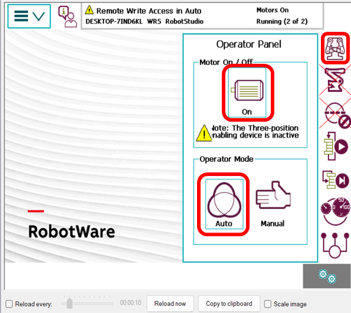
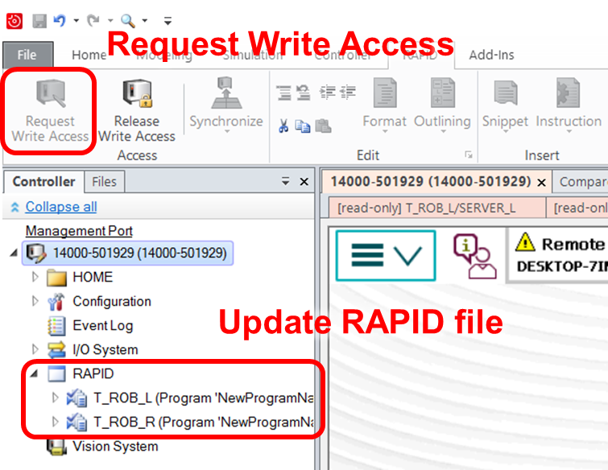
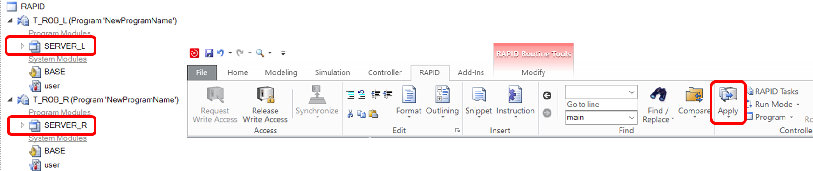
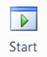
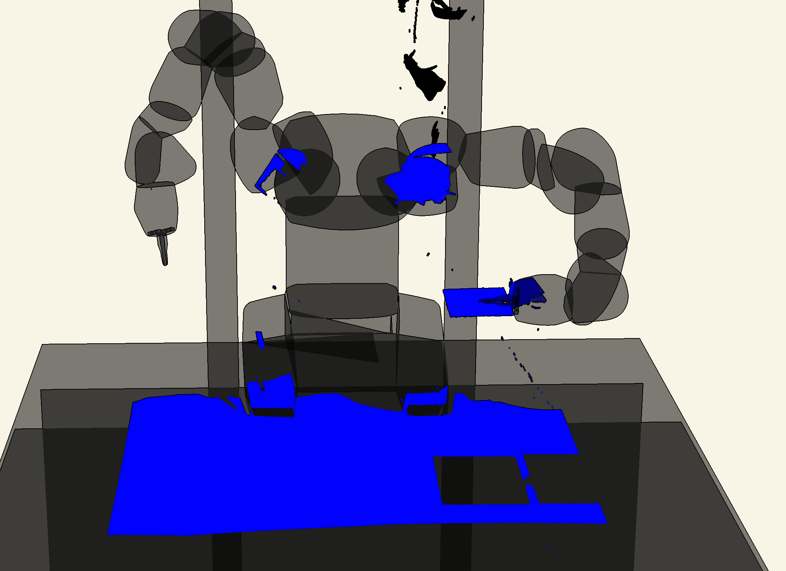
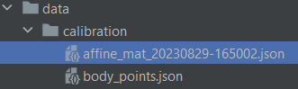

# Tutorial: Robot-Phoxi Calibration Guidance

## Prerequisites
### Running the Phoxi Server
To begin, ensure that you have the Phoxi Server up and running. Refer to [phoxi_server.md](phoxi_server.md) for detailed instructions.

### Make the Robot to Grasp the Calibration Board
1. Prepare the Calibration Board.

    

2. Make sure the robot grasps the calibration board **firmly**. It's essential that the board does not slip from the robot's hand.
    - If the board isn't held securely, you can use tape to fix it in place.
    - By default, the calibration board is assumed to be grasped by the left arm.
   
         

### Revise Phoxi Client IP Address
1. Check the host IP address in [phoxi_server.py](..%2Fdrivers%2Frpc%2Fphoxi%2Fphoxi_server.py). Locate the following code:
    ```Python
   if __name__ == "__main__":
    serve(serialno="2019-04-009-LC3", host="127.0.0.1:18300")
   ```
   - `host` argument contains the configured IP address.
2. Update [constants.py](..%2Fhuri%2Fcore%2Fconstants.py). Find the following code:
    ```Python
   class SENSOR_INFO:
       IP_ADR_DEPTH_SENSOR = "127.0.0.1:18300"
       IP_ADR_DEPTH_SENSOR_DEBUG = "127.0.0.1:18300"
       PNT_CLD_CALIBR_MAT_PATH = workdir_data.joinpath("calibration", "qaqqq3.json")
   ```
   Modify the `IP_ADR_DEPTH_SENSOR` value to match your host's IP address.

### Update ABB YUMI RAPID
1. Configure the YUMI controller panel as follows:
    - Set `Motor On/Off` as `On`
    - Set `Operator Mode` as `Auto`
    

2. On your computer, launch *RobotStudio*. Connect to the robot and request write access.

    
3. Overwrite the `SERVER_L` and `SERVER_R` files by copying the contents from [SERVER_L.mod](..%2Fdrivers%2Fyumi%2FSERVER_L.mod)
    and [SERVER_R.mod](..%2Fdrivers%2Fyumi%2FSERVER_R.mod).
    Then, apply the changes.
    
    

4. Press `Ctrl`+`Shift`+`M` to set `Program Pointer To Main`. And then click `Start` button to execute the program. 

## Run Calibration

- Adjust the calibration setting in [utils.py](..%2Fhuri%2Fvision%2Fcalibration%2Futils.py).
    - Locate the `CalibrationSettings` class:
      - Set `work_arm` to either `lft_arm` or `rgt_arm`, depending on which arm is holding the calibration board.
- Run [calibration.py](..%2Fhuri%2Fvision%2Fcalibration%2Fcalibration.py).
- Upon successful calibration, the result will be displayed:
    

- A file named `affine_mat_xxx-xxx.json` will be generated within [calibration](..%2Fhuri%2Fdata%2Fcalibration) directory.

    

- Update [constants.py](..%2Fhuri%2Fcore%2Fconstants.py). Locate the following code:
    ```Python
   class SENSOR_INFO:
       IP_ADR_DEPTH_SENSOR = "127.0.0.1:18300"
       IP_ADR_DEPTH_SENSOR_DEBUG = "127.0.0.1:18300"
       PNT_CLD_CALIBR_MAT_PATH = workdir_data.joinpath("calibration", "qaqqq3.json")
   ```
    Replace `qaqqq3.json` with the actual filename you generated for the affine matrix. (`affine_mat_xxx-xxx.json`) 


    
    
