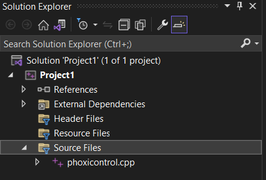

# Tutorial: Compiling the CPP File to Run phoxi_server.py
This tutorial provides instructions for compiling the CPP file ([phoxi_server.py](..%2Fdrivers%2Frpc%2Fphoxi%2Fphoxi_server.py)) to run the phoxi_server.py script.

## Compile the CPP file ([phoxicontrol.cpp](..%2Fdrivers%2Fdevices%2Fphoxi%2Fphoxicontrol.cpp))

1. Install Visual Studio (https://visualstudio.microsoft.com/vs/community/). Here we use the visual studio 2022 community as an example.

    
2. Launch Visual Studio and click the "Create a New Project" button.

    

3. Select "Empty Project" and proceed to the next step. Name your project and choose a directory to save it.

    

4. Copy and paste the [phoxicontrol.cpp](..%2Fdrivers%2Fdevices%2Fphoxi%2Fphoxicontrol.cpp) file to the "Source Files" section of your project.

    

5. Right-click on your project and select "Properties".

    

6. In the "Property Pages":
    - Set the `Configuration` to `Release`.
    - Under `Configuration Properties/General`, choose `Configuration Type` as `Dynamic Library (.dll)`. And set `Target name` as `phoxicontrol`.
         
   
    - Under `Configuration Properties/Advanced` page, set `Target File Extension` to `.pyd`
        
   
    - Under `VC++ Directories` page, add the following paths to "Include Directories" (separated by `;`):
        

      - **Phoxi Control API Include Path**: Locate the installation destination of *Phoxi Control*. The include directory for Phoxi Control should be `<Your phoxi control installation path>\API\include`.
      - **Python Interpreter Include Path**:  Find the installation destination of *Python. The include directory for Python should be `<Your python installation path>\include`.
      - **Pybind 11 Include Path**: Locate the installation destination of *Pybind 11*. You can find it in your *PyCharm* environment under `Project` page -> `External Libraries` -> `Python`-> `site-packages`.
         
      
      Search `pybind11` in the `site-packages`. And right click its `include` folder to copy its path.
      
      
   
      For example my pybind11 include directory is `E:\Venv\Lib\site-packages\pybind11\include`

    - In the same `VC++ Directories` section, add the following paths to `Library Directories`:
         
      -  **Phoxi Control API Lib Path**: `<Your phoxi control installation path>\API\lib`. 
      - **Python Interpreter Lib Path**: `<Your python installation path>\libs`.
    
    - Under `Configuration Properties/Linker/Input` page, add the following library file names:
         
   
      - **Python Library File**: See `<Your python installation path>\libs`, and find the `python3x.lib` file. For example, my lib file name is `python39.lib`.
      - **Phoxi Control API Library File**: See `<Your phoxi control installation path>\API\lib`, and find the `PhoXi_API_msvc14_Release_1.x.x.lib` file. For example, my lib file name is `PhoXi_API_msvc14_Release_1.7.5.lib`.

7. Set the compile mode to `Release` and compile the file.
    

8. If everything is successful, you'll see the following output:
    

9. Copy the generated `.pyd` file to the to [phoxi](..%2Fdrivers%2Fdevices%2Fphoxi) folder.

10. Finally, revise [__init__.py](..%2Fdrivers%2Fdevices%2Fphoxi%2F__init__.py)
    - Locate ```os.add_dll_directory("C:\Program Files\Photoneo\PhoXiControl-1.7.5\API\\bin")```
    - Revise the path inside `os.add_dll_directory` to `<Your phoxi control installation path>\API\bin`

Following these steps will enable you to compile the CPP file and prepare it for use with the [phoxi_server.py](..%2Fdrivers%2Frpc%2Fphoxi%2Fphoxi_server.py) script.

If `phoxi_server.py` runs successfully, you will see the following messages.


